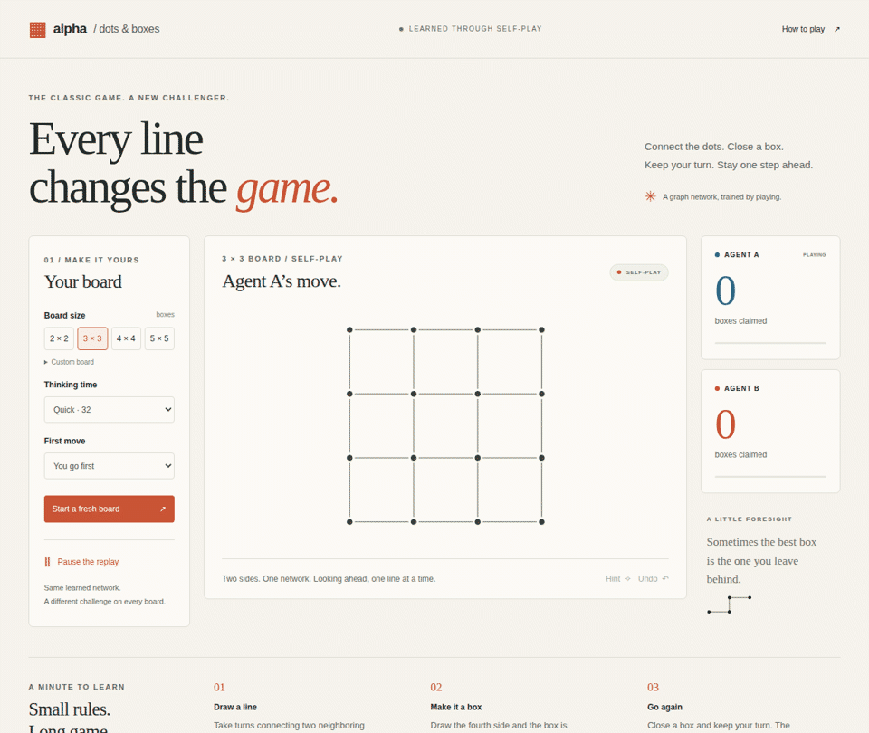

<div align="center">

# Alpha Dots & Boxes

**Every line changes the game.**

A graph network that learns the classic pencil-and-paper game by playing itself.

[](https://github.com/IlyaKhalafi/AlphaDotsAndBoxes/actions/workflows/tests.yml)


[](LICENSE)



</div>

Draw a line. Close a box. Take another turn. Behind this simple game is a tricky
question: when should you take a box, and when should you give one away?

Alpha Dots & Boxes learns through self-play and looks ahead before moving. Its
network represents the relationships between edges and boxes, so the same
weights work on square and rectangular boards of different sizes.

## Play locally

Python 3.11 or newer is required. Playing uses NumPy; no GPU or training framework is needed.

```bash
git clone https://github.com/IlyaKhalafi/AlphaDotsAndBoxes.git
cd AlphaDotsAndBoxes
python -m venv .venv
source .venv/bin/activate
python -m pip install .
adb serve --checkpoint models/agent.npz
```

Open **http://127.0.0.1:8000**. Choose a board, adjust thinking time, and play.
The interface supports hints, undo, keyboard controls, custom rectangular boards,
and an agent-versus-agent watch mode. Board dimensions count **boxes**, not dots.

The included checkpoint is a small trained starting point. The UI also uses
perfect search for the last 12 available edges. Launching `adb serve` without a
checkpoint selects a clearly labeled tactical opponent.

Or deploy the included model with Docker:

```bash
docker build -t alpha-dots-and-boxes .
docker run --rm -p 9003:8000 alpha-dots-and-boxes
```

Open **http://localhost:9003**. See [deployment notes](docs/deployment.md) for custom models and hosting.

## What makes it different

- **One network, many boards.** No fixed board-sized output layer.
- **Learned by playing.** Search decisions and final results become training data.
- **Correct extra turns.** Capturing a box keeps the player active in both rules
  and search.
- **Built with RLlib.** Its learner updates the graph network; Ray workers collect
  games in parallel.
- **Measured openly.** Results, raw outcomes, settings, and limitations live in
  [docs/results.md](docs/results.md).

The released model is an experimental opponent. Beating expert humans has not
been demonstrated; that requires stronger training and actual human matches.

## A look inside


The network asks two questions: **where should I draw?** and **can I win?**
Search uses those answers to explore possible moves. After the game, RLlib
updates the network from the choices it searched and the result it reached.

See [the architecture notes](docs/architecture.md) for the detailed design.

## Train your own

Install the optional training tools; PyTorch and RLlib are used only here:

```bash
python -m pip install -e '.[train]'
```


A short CPU run checks the complete pipeline:

```bash
adb train --config configs/smoke.json --output runs/smoke
```

For a first training run:

```bash
adb train --config configs/bootstrap.json --output runs/bootstrap
```

Use `--device cuda` to train the learner on a GPU. CPU search workers remain
separate. GPU training has a configurable allocation cap and pacing; review
[the training guide](docs/training.md) before using shared hardware.

```bash
adb train --config configs/bootstrap.json --output runs/bootstrap --device cuda
adb export --checkpoint runs/bootstrap/latest.pt --output models/custom.npz
adb serve --checkpoint models/custom.npz
```

Runs save progress, portable agent checkpoints, and a resumable learner state.
The [training guide](docs/training.md) covers resuming, refinement, and a longer
campaign with larger boards.

## Evaluate and develop

```bash
adb evaluate --checkpoint models/agent.npz --games 40 --sizes 2x2,3x3,4x4
python -m pip install -e '.[dev]'
pytest -q
```

Evaluation alternates seats and tests random, tactical, and exact-search
opponents where practical. Its default disables the agent's exact endgame aid.

```text
src/alphaboxes/   rules, graphs, search, RLlib training, evaluation, web UI
configs/         smoke, bootstrap, refinement, and longer training presets
models/          playable checkpoint and model notes
docs/            architecture, training, measurements, and visual assets
tests/           rules, invariance, search, learner resume, and API checks
```

To regenerate the UI recording, install the optional media tools, start the
server, and run:

```bash
python -m pip install -e '.[media]'
playwright install chromium
python scripts/capture_ui.py
```

MIT licensed. Improvements backed by reproducible experiments are welcome.
