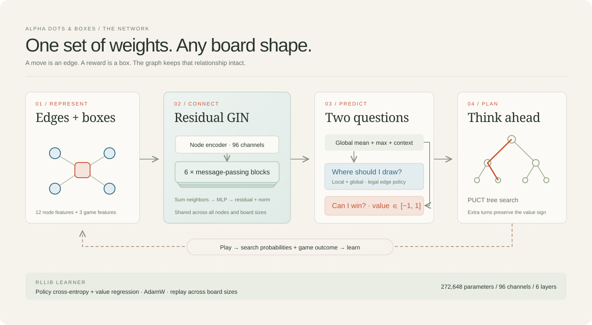

# Architecture and training design

The agent combines a residual Graph Isomorphism Network (GIN), perspective-aware
PUCT search, and an AlphaZero self-play objective implemented with RLlib's
`TorchRLModule`, `TorchLearner`, and `LearnerGroup`. Ray actors collect games in
parallel. Both seats use the same network.



## Why this graph

For a board with R × C boxes, there are E = (R + 1)C + R(C + 1) playable edges
and B = RC boxes. The graph has E + B nodes. Each box connects to its four
boundary edges. Every edge connects to one or two boxes. Adjacency remains fixed
within a game; occupancy and box ownership change in the node features.

This makes a legal move a graph node rather than an index in a fixed board-sized
output layer. No coordinates, flattening, or size-specific weights are used.
Relabeling nodes, rotating a board, or reflecting it preserves the graph
computation. Tests explicitly check node permutation and padding invariance.

All message-passing GNN families can process varying graph sizes. GIN is chosen
for sum aggregation, which can distinguish different neighbor counts; variable
size alone is not a reason to prefer GIN over GCN. This is a principled starting
architecture, not an empirically established best architecture: a controlled
GCN/GAT/GIN ablation has not been run.

## Features and heads

The 12 node channels encode:

| Channels | Meaning |
| --- | --- |
| 0–1 | Edge or box node |
| 2 | Edge is occupied |
| 3–4 | Box belongs to current player or opponent |
| 5–9 | Box has 0, 1, 2, 3, or 4 remaining sides (one-hot) |
| 10 | Edge's number of adjacent boxes, divided by two |
| 11 | Adjacent boxes completed by drawing this edge, divided by two |

Three game channels encode score difference from the current player's
perspective, remaining edge fraction, and unclaimed box fraction. They are
broadcast into the node encoder and passed to the heads.

The default network has **272,648 parameters**, 96 hidden channels, and six GIN
blocks. Each block computes:

```text
mᵢ = Σ hⱼ                                for neighbors j of node i
hᵢ' = LayerNorm(hᵢ + MLP((1 + ε)hᵢ + mᵢ))
```

ε is learned. The two-layer MLP expands to 192 channels and uses SiLU. Padded
nodes are zeroed after every block. Global mean and max pooling ignore padding.
The policy head consumes local embeddings plus global context and emits one
logit per node; box nodes and occupied edges are masked. The value head consumes
global context and emits a tanh-bounded expected win/draw/loss value.

Six layers cover a local region, and pooled context summarizes the whole board.
Pooling does not replace detailed long-range chain reasoning. Larger boards and
long chains remain important evaluation targets. Search supplies additional
planning depth without changing the learned weights.

## Search and the extra-turn rule

PUCT balances prior probability, visit count, and backed-up value. Root
Dirichlet noise is enabled for self-play only. Its concentration scales with the
root branching factor. Early self-play moves sample the visit distribution;
later moves select a most-visited edge. Targets remain the full normalized visit
distribution.

Every value is relative to the player to move at its node. A backup changes sign
**only when player identity changes**. Completing a box keeps the player and
the sign; completing two boxes also keeps the player and awards both boxes.
Terminal values are +1 for a win, 0 for a draw, and −1 for a loss. Training uses
terminal outcomes, not intermediate box rewards.

An optional exact minimax oracle solves small endgames using occupancy bitsets
and memoization. Historical edge ownership is irrelevant to future play. The
oracle maximizes final box margin. It is disabled in the training presets and
the default evaluation command. The UI enables it in late games; evaluations
with it enabled are reported separately so its contribution is visible.

## RLlib's role

`GraphModule` is an RLlib `TorchRLModule`; `AlphaZeroLearner` subclasses
`TorchLearner`. `LearnerGroup.update()` runs forward/backward passes, AdamW
updates, gradient clipping, and learner metrics. The objective is policy
cross-entropy against search probabilities plus mean squared error against the
terminal outcome. Weight decay is 1e−4, initial learning rate is 3e−4, and the
global gradient norm limit is 1.0.

The training driver owns game search, replay, and sampling schedules. Ray
workers do CPU search with independent seeds and receive current learner weights
once per iteration. RLlib's lower-level learner API is used deliberately;
this is not PPO renamed as AlphaZero. Library use alone does not guarantee a
speedup; no comparison against an equivalent pure implementation is claimed.

Minibatches pad only to the largest graph in that batch. RLlib environment
spaces have a configured capacity to satisfy Gymnasium's fixed-space contract;
the network has no capacity-dependent parameters and inference uses actual graph
sizes. The multi-agent environment also passes RLlib's environment checker.

## Practical limits and reproducibility

The rules and network support arbitrary positive rectangular dimensions. The
web UI and training configuration bound boards to 12×12 / 144 boxes to keep
interactive search and dense adjacency allocations practical. Dense adjacency
costs O((E+B)²) memory per observation. Very large boards should use sparse
aggregation and stronger throughput engineering before extended training.

Inference checkpoints contain weights and plain metadata, loaded with
`weights_only=True`. Resumable checkpoints also contain RLlib optimizer state,
replay, and the driver's RNG state; load these only from trusted local runs.
Resuming retains learning progress but restarts worker RNG streams, so it does
not reproduce an uninterrupted run bit for bit. CUDA operations can also vary
across hardware/software versions.

## References

- [GIN: How Powerful are Graph Neural Networks?](https://arxiv.org/abs/1810.00826)
- [AlphaZero: Mastering Chess and Shogi by Self-Play](https://arxiv.org/abs/1712.01815)
- [RLlib RLModules](https://docs.ray.io/en/latest/rllib/rl-modules.html)
- [RLlib learners](https://docs.ray.io/en/latest/rllib/learner.html)
