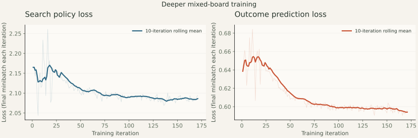

# Eight-hour mixed-board follow-up

Expert-human strength remains unproven. This run follows a reported 16–9 human win on 5×5 with Deep thinking.

The first overnight attempt failed during iteration 22 at its own CUDA allocation cap. Recovery restored iteration 20, discarded 96 uncheckpointed games, and kept their elapsed time against the original budget. Expandable allocations, full checkpoints each iteration and bounded restart supervision were added. The recovery receipt preserves the failed record. Any further batch reductions appear in the final configuration.

Training seed 44 completed 171 iterations, 18,496 new games and 823,572 new positions in 8.039 hours. Peak PyTorch allocation was 66961.77 MiB.

The warm start is larger-board iteration 200 (3,200 phase games), descended from the 1,280-game bootstrap. Phase counters start fresh. Iterations 1–20 used 256 simulations, eight CPU workers and batches of 1,024. Iterations 21–66 used 512 simulations, twelve CPU workers, 96 games per iteration, batches of 32,768 and a 64 GiB cap. From iteration 67, twelve batched CPU samplers and two GPU samplers collect 128 games per iteration. GPU calls use captured replay; optional compiled kernels accelerate child scoring and exact endgames. Learner batches increased to 40,960 with a 72 GiB learner cap; the two GPU samplers each have a 1 GiB allocator cap. Recovery may halve learner batches; the final configuration records their actual size. All later segments retain 16 updates per iteration, 500,000 replay positions, 512 search simulations, weighted 5×5 sampling and exact root endgames with at most 12 edges. The eight-hour budget includes training time before restarts, while startup, configuration pauses and overnight downtime are excluded. Full segment configurations and [performance receipts](performance.md) preserve the changes.

Selection seed 3040 chose `agent-00010` by mean score on 4×4 and 5×5 against two scripted opponents and the warm-start checkpoint. The final iteration need not be selected. The leaderboard and complete outcomes are in [the data directory](data/deep-campaign/).

Fresh NumPy tests use seed 3041. Standard search uses 128 simulations with the agent's exact aid disabled; Deep uses 512 simulations and the UI's 12-edge aid. Duels use six randomized opening moves and balanced seats. Win intervals and full move lists are in the receipts. These are limited seeded samples against heuristics and other checkpoints, not expert-human matches.

| Test | Board | Opponent | Wins–draws–losses | Score rate |
| ---- | ----- | -------- | ---------------- | ---------- |
| baseline-duel | 4×4 | checkpoint | 31–1–8 | 78.8% |
| baseline-duel | 5×5 | checkpoint | 34–0–6 | 85.0% |
| preview-duel | 4×4 | checkpoint | 24–2–14 | 62.5% |
| preview-duel | 5×5 | checkpoint | 20–0–20 | 50.0% |
| deep-preview-duel | 4×4 | checkpoint | 23–6–11 | 65.0% |
| deep-preview-duel | 5×5 | checkpoint | 22–0–18 | 55.0% |
| scripted | 4×4 | tactical_endgame | 36–3–1 | 93.8% |
| scripted | 4×4 | chain_control | 33–1–6 | 83.8% |
| scripted | 5×5 | tactical_endgame | 40–0–0 | 100.0% |
| scripted | 5×5 | chain_control | 35–0–5 | 87.5% |
| transfer | 3×3 | tactical_endgame | 28–0–12 | 70.0% |
| transfer | 3×3 | chain_control | 28–0–12 | 70.0% |
| transfer | 2×5 | tactical_endgame | 25–4–11 | 67.5% |
| transfer | 2×5 | chain_control | 30–1–9 | 76.2% |
| heldout-6x6 | 6×6 | tactical_endgame | 19–1–0 | 97.5% |
| heldout-6x6 | 6×6 | chain_control | 19–0–1 | 95.0% |

The pre-recorded promotion gate requires at least 50% score against the preview on each board at both search budgets, and more than 50% on 5×5 Deep. It is a practical regression gate, not a statistical superiority claim.

**Promotion gate: passed.**

[Configuration, hashes, parity checks and raw results](data/deep-campaign/). No human moves were used as training labels.
