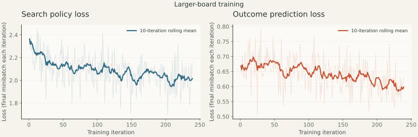

# Experiments and observations

The agents have learned useful tactics and can process different board sizes.
**Expert-human strength has not been demonstrated.** The original bootstrap's
endgame benchmark exposes weaknesses, especially on an unseen rectangular board.
This report includes those failures alongside the improvements.

Measurements below were collected on October 9, 2026. Dimensions count boxes.
The checkpoints and their training history are described in
[the model notes](../models/README.md).

## Original small-board training

Both phases use a six-block, 96-channel residual GIN with 272,648 parameters,
training seed 42, and uniformly sampled 1×2, 2×2, 2×3, and 3×3 boards. Four
single-threaded Ray workers collect self-play; the RLlib learner uses the shared
H200. Each iteration collects 16 games and performs 16 updates with batch size 128. AdamW starts at learning rate 0.0003; replay holds 20,000 positions.

| Measurement                        |      Bootstrap |            Bounded refinement |
| ---------------------------------- | -------------: | ----------------------------: |
| Iterations                         |           1–80 |                        81–160 |
| Additional self-play games         |          1,280 |                         1,280 |
| Additional positions               |         19,426 |                        19,384 |
| Cumulative games / positions       | 1,280 / 19,426 |                2,560 / 38,810 |
| Search simulations per decision    |             32 |                            64 |
| Exact endgame aid during self-play |       Disabled | Root with ≤12 remaining edges |
| Recorded loop time                 |       693.63 s |                      701.31 s |
| Median iteration time              |         8.55 s |                        8.62 s |
| Peak PyTorch allocation            |     148.47 MiB |                    148.50 MiB |
| Last 10 mean policy loss           |         1.5843 |                        1.4634 |
| Last 10 mean value loss            |         0.4996 |                        0.2910 |

Refinement resumes optimizer state and replay from bootstrap. It changes both
the search budget and solver availability, so their individual effects cannot
be separated from these runs. Bootstrap uses only learned search and game rules;
refinement is solver-guided self-play. Neither uses human games or move labels.

The two recorded loops total 23.25 minutes, excluding startup and evaluation.
Losses are the final minibatch reported in each iteration, not full-replay
averages. Lower loss alone is not evidence of stronger play.


The learner had a 4 GiB allocator cap and 0.15 application duty-cycle target.
Observed process-level GPU memory was approximately 918 MiB, including CUDA
context allocations. A separate process used approximately 34,500 MiB during
refinement and remained running afterward. No GPU modes, resets, or unrelated
processes were changed. These resource measurements do not establish zero
latency interference with the other workload.

The tested environment was Python 3.12.3, PyTorch 2.12.1 with CUDA 13.0, Ray/RLlib
2.58.0, Gymnasium 1.2.2, and NumPy 2.5.1. Resolved configurations and software
versions are in [training-summary.json](data/training-summary.json); complete
iteration metrics are in [bootstrap CSV](data/training-bootstrap.csv) and
[refinement CSV](data/training-refined.csv).

## Fresh tests of the original bootstrap checkpoint

`models/agent.pt` is bootstrap iteration 80. These fresh tests use evaluation
seed **2027**, 40 games per opponent/board, alternating seats equally, and 128
search simulations per decision. The agent's exact solver is **disabled**.
Boards 4×4 and 2×5 were absent from training. The 2×5 board was also absent from
the checkpoint-selection comparison.

“Tactical” takes available boxes and avoids giving away a third side when
possible. “Tactical + endgame” adds exact minimax for the final 12 edges; it is
stronger but is not an independently validated expert-human proxy. Random play
is included as a basic sanity check.

| Board | Opponent           | Wins–draws–losses | Win rate | 95% win interval | Score rate |
| ----- | ------------------ | ----------------: | -------: | ---------------: | ---------: |
| 3×3   | Random             |            40–0–0 |     100% |        91.2–100% |       100% |
| 3×3   | Tactical           |            38–0–2 |      95% |       83.5–98.6% |        95% |
| 3×3   | Tactical + endgame |           18–0–22 |      45% |       30.7–60.2% |        45% |
| 4×4   | Random             |            40–0–0 |     100% |        91.2–100% |       100% |
| 4×4   | Tactical           |            35–3–2 |    87.5% |       73.9–94.5% |     91.25% |
| 4×4   | Tactical + endgame |            33–1–6 |    82.5% |       68.0–91.3% |     83.75% |
| 2×5   | Random             |            40–0–0 |     100% |        91.2–100% |       100% |
| 2×5   | Tactical           |            33–4–3 |    82.5% |       68.0–91.3% |      87.5% |
| 2×5   | Tactical + endgame |           13–2–25 |    32.5% |       20.1–48.0% |        35% |

Score rate gives a draw half a point. Intervals use Wilson's formula with
z=1.96 for wins, not score rate. They describe uncertainty in these seeded
samples; correlations between games and opponent limitations are not modeled.
Raw outcomes, seats, margins, timings, and checkpoint hashes are retained in
[3×3](data/selected-search-3x3.json), [4×4](data/selected-search-4x4.json), and
[2×5](data/selected-search-2x5.json) receipts.

The 3×3 stronger-opponent result falls from 65% in the selection sample to 45%
in this fresh sample. That variation and the weak 2×5 result rule out a claim
of robust expert play or reliable arbitrary-size generalization.

An informal human test reported an easy 9–7 win on 4×4 boxes using Deep thinking
(512 search simulations). The player confirmed the dimensions after initially
describing the board as “5×5.” No replay or seat was recorded, so this is feedback
rather than an additional benchmark.
The UI now labels active dimensions in boxes and applies board presets
immediately to prevent a selected size from differing from the active game.
Increasing thinking time does not replace larger-board training and human tests.

After the larger-board NumPy preview was installed, the same player reported a
10–6 loss to the agent on the requested 4×4 Deep test. The seat was not reported.
That is one encouraging informal human result, alongside the earlier 9–7 win
over bootstrap; it does not establish strength against high-level human players.

The same player subsequently beat this preview **16–9 on 5×5**, again using
Deep thinking. The [saved terminal board](data/human-preview-5x5-final.json)
confirms 25 boxes, the human playing
first, and that score. Only the final position was retrieved; individual move
mistakes cannot be established from it. This larger-board loss motivated a
three-hour follow-up with deeper self-play search, rather than a strength claim
based on the earlier 4×4 win.

## Larger-board preview

The broader campaign warm-starts bootstrap weights with a new optimizer and
replay, training seed 43, and uniformly mixed 3×3, 4×4, 3×5, and 5×5 boards.
The currently playable snapshot is iteration 80: 1,280 additional games and
51,540 new positions, using 64 search simulations and exact root decisions
with at most 12 remaining edges. The bounded campaign finished at iteration
239 after 4,818.67 seconds, with 3,824 new games and 153,630 new positions.
The UI still serves the iteration-80 preview while fresh candidate tests run.
Its weights therefore differ from the last training checkpoint.

The complete run used four CPU workers, batches of 128, 32 updates per
16-game iteration, learning rate 0.00015, and a 60,000-position replay buffer.
Median iteration time was 19.94 seconds; peak PyTorch allocation was 278.85
MiB with a 4 GiB cap and 15% update pacing. Counters are for this new phase;
the bootstrap ancestor contributed another 1,280 games and 19,426 positions.
Full metrics are in [the CSV](data/training-larger-20261009.csv).



Checkpoint selection used seed 3030 and 20 games per board/opponent, with
128 simulations and the agent's exact aid disabled. The opponents were
tactical endgame, chain control, and the original bootstrap. The checkpoint
duels used six randomized opening moves and equal search budgets. Scores below
average the three opponents; the selection criterion averages both boards.

| Warm-start iteration | 4×4 mean score | 5×5 mean score | Joint mean |
| -------------------- | -------------: | -------------: | ---------: |
| Bootstrap baseline   |          70.0% |          70.0% |      70.0% |
| 40                   |          83.3% |          90.0% |      86.7% |
| 80 (UI preview)      |          86.7% |          88.3% |      87.5% |
| 120                  |          90.0% |          90.0% |      90.0% |
| 160                  |          89.2% |          95.0% |      92.1% |
| **200 (selected)**   |      **90.0%** |      **95.0%** |  **92.5%** |
| 239 (last)           |          85.0% |          93.3% |      89.2% |

The [selection receipt](data/larger-selection.json) records per-opponent
scores and hashes; raw [4×4](data/larger-selection/4x4) and
[5×5](data/larger-selection/5x5) receipts retain individual outcomes and duel
move lists. Differences near the top are small and the sample is
limited; selecting iteration 200 is a heuristic, not proof of superiority.
Fresh NumPy tests use seed 3033, including direct comparisons against the
preview, a 4×4 Deep check, rectangular transfer, and held-out 6×6 play.

The completed fresh checks do **not** justify replacing the preview. Equal
128-simulation search beats bootstrap, but ties the preview on 5×5; the
4×4 Deep comparison scores below 50%. The later model therefore remains a
training initialization rather than the recommended deployment checkpoint.

| Candidate iteration 200 / test | Board | Wins–draws–losses | Score rate |
| ------------------------------ | ----- | ---------------: | ---------: |
| Bootstrap, standard duel       | 4×4   |            29–6–5 |        80% |
| Bootstrap, standard duel       | 5×5   |            32–0–8 |        80% |
| Preview, standard duel         | 4×4   |            28–4–8 |        75% |
| Preview, standard duel         | 5×5   |           20–0–20 |        50% |
| Preview, Deep duel             | 4×4   |           8–2–10 |        45% |
| Tactical endgame               | 5×5   |            38–0–2 |        95% |
| Chain control                  | 5×5   |            36–0–4 |        90% |
| Tactical endgame (unseen size) | 6×6   |            18–0–2 |        90% |
| Chain control (unseen size)    | 6×6   |            18–1–1 |      92.5% |

Standard duels and scripted 4×4/5×5 tests use 40 games per entry and no
agent endgame aid. The 4×4 Deep duel uses 20 games, 512 simulations and the
UI aid; 6×6 tests use 20 games. Duels randomize six opening moves and balance
seats. [Raw fresh receipts](data/larger-fresh) retain every outcome, settings,
hashes, and duel move lists. NumPy inference runs in a clean installation
without PyTorch/RLlib. Strong scripted results on unseen 6×6 do not establish
expert play or improvement over the preview. The additional [5×5 Deep match](data/larger-fresh/deep-preview-duel-5x5.json)
finished 17–0–23 over 40 games (42.5% score), confirming another regression
against the preview at the UI's thinking budget.

The subsequent run warm-starts iteration 200 with seed 44. Its first 20
iterations completed 640 games and 28,118 positions in 1,229.49 seconds,
using 256 simulations, eight workers, batch size 1,024, and an 8 GiB cap.
It then resumed the same optimizer and replay with a total **eight-hour**
budget, 512 simulations, 12 workers, 96 games per iteration, 16 updates,
batch size 32,768, 500,000 replay positions, a 64 GiB allocator cap, and
50% application update pacing. Five-by-five is sampled twice as often as
each of 3×3, 4×4, and 3×5. Both segments enable exact root endgames with at
most 12 remaining edges. The time budget includes the initial segment;
startup and the configuration pause are excluded.

Before resuming, a disposable RLlib learner completed one full 32,768-position
5×5 update with 52.33 GiB peak allocation and 55.23 GiB reserved memory.
Its weights were discarded. The separate GPU process remained running at
about 34.7 GiB. Batched graph encoding reproduced 83 previously encoded
square, rectangular, terminal and padded observations exactly. A repeated-5×5
batch preparation diagnostic fell from 6.86 seconds to 0.73 seconds after
vectorization. These are local resource/preparation measurements, not an
end-to-end throughput or strength comparison. The
[probe receipt](data/deep-large-batch-probe.json) records timings and limits.
The overnight run failed during iteration 22: unused cached CUDA blocks caused
an allocation failure at the process's own 64 GiB cap, despite 42.45 GiB of
device memory remaining free. It logged 736 games and 32,484 positions through
iteration 21, using 1,478.90 seconds; it did **not** complete eight hours.
The previous full resume state contained iteration 20, so recovery rolled back
96 games while retaining their elapsed time against the original budget.
Failed-run weights and logs were archived before resuming.

Recovery started on October 10 at 06:17 UTC with expandable CUDA allocations,
the same 32,768 batch size, and 7 hours 35 minutes remaining. Four consecutive
disposable updates, including growth from 32,484 to 32,768 positions, passed;
peak allocation was 52.33 GiB and reserved memory stabilized at 55.26 GiB.
Full resume checkpoints now save every iteration. A bounded supervisor records
progress and retries memory failures with smaller batches, up to three times.
[Recovery measurements](data/deep-recovery.json) preserve the failed iteration
record, time accounting, and repeated probe results. This run is in progress;
the playable checkpoint remains the preview, and no new strength is claimed.

### Preview deployment checks

NumPy deployment tests use seed 3032, 20 games per opponent, alternating seats,
512 simulations, and the UI's 12-edge endgame aid. The checkpoint duel uses six
randomized opening moves and independent move RNG streams for each network.

| 4×4 opponent                   | Wins | Draws | Losses | Score rate |
| ------------------------------ | ---: | ----: | -----: | ---------: |
| Bootstrap, equal search budget |   18 |     0 |      2 |        90% |
| Tactical endgame               |   19 |     0 |      1 |        95% |
| Chain control                  |   18 |     2 |      0 |        95% |

The [duel receipt](data/larger-preview-deep-duel.json) and
[scripted-opponent receipt](data/larger-preview-deep-scripted.json) retain settings,
hashes, raw outcomes, and confidence intervals; the duel also retains move lists.
These are encouraging comparisons, not high-level human matches. The
[bootstrap Deep benchmark](data/bootstrap-deep-4x4.json) uses PyTorch inference,
so its scripted-opponent results are not an isolated test of weight changes.
The direct duel compares both exported networks with NumPy.
Additional [retention tests](data/larger-preview-retention.json) check 3×3 and
unseen 2×5 boards without the agent's exact endgame aid. Their small samples
still expose losses, so size flexibility should not be read as uniform strength.

## Original checkpoint selection and refinement

The earlier seed-2026 sample informed checkpoint selection. Bootstrap was
evaluated in a single multi-board command; refinement used separate per-board
commands. RNG consumption differs, so these are descriptive comparisons rather
than paired trials. All entries below use 128 learned-search simulations with
the agent's solver disabled.

| Board / opponent         | Bootstrap W–D–L | Bootstrap score | Refined W–D–L | Refined score |
| ------------------------ | --------------: | --------------: | ------------: | ------------: |
| 2×2 / Tactical           |         20–18–2 |           72.5% |       25–12–3 |         77.5% |
| 2×2 / Exact              |         0–20–20 |             25% |       20–0–20 |           50% |
| 3×3 / Tactical           |          36–0–4 |             90% |        37–0–3 |         92.5% |
| 3×3 / Tactical + endgame |         26–0–14 |             65% |       23–0–17 |         57.5% |
| 4×4 / Tactical           |          32–2–6 |           82.5% |        35–2–3 |           90% |
| 4×4 / Tactical + endgame |          30–3–7 |          78.75% |        30–4–6 |           80% |

The unweighted mean score against tactical + endgame on 3×3 and 4×4 is 71.875%
for bootstrap and 68.75% for refinement. Bootstrap is the conservative default;
confidence intervals overlap and this small sample does not prove it is better.
Refinement improved exact small-board play and simple tactical results while
reducing training loss. It did not consistently improve the harder benchmark.

On 2×2, exact minimax gives the first player a forced 3–1 win. An optimal agent
therefore wins its 20 first-seat games and loses its 20 second-seat games against
perfect play. The refined checkpoint achieves that outcome in this sample with
its own solver disabled; this is a small-board check, not a human-strength result.

For completeness, refinement scores 90% against tactical and 63.75% against
tactical + endgame on 2×5 in its seed-2026 sample. That result uses a different
checkpoint and seed from the final default-agent test above.

Receipts: [bootstrap](data/bootstrap-search.json), refinement
[2×2](data/refined-search-2x2.json), [3×3](data/refined-search-3x3.json),
[4×4](data/refined-search-4x4.json), and [2×5](data/refined-search-2x5.json).

## Did the network learn, and does search help?

Greedy policy-only tests remove search and the agent's endgame solver. The
untrained control is the same architecture initialized with seed 42. Tests use
seed 2026 and 40 balanced-seat games per entry; ties are randomized.

| Board / opponent         | Untrained greedy score | Bootstrap greedy score | Bootstrap search score | Refined greedy score |
| ------------------------ | ---------------------: | ---------------------: | ---------------------: | -------------------: |
| 3×3 / Tactical           |                     0% |                    75% |                    90% |                87.5% |
| 3×3 / Tactical + endgame |                     0% |                  42.5% |                    65% |                32.5% |
| 4×4 / Tactical           |                     0% |                    80% |                  82.5% |                82.5% |
| 4×4 / Tactical + endgame |                     0% |                 71.25% |                 78.75% |                  60% |

The trained greedy policy improves substantially over the untrained control.
Search further improves several measured scores, particularly on 3×3. No
untrained-search control was run, and these samples do not isolate every source
of improvement. A GCN/GAT/GIN architecture comparison has not been performed.

Receipts: [untrained policy](data/untrained-policy.json),
[bootstrap policy](data/trained-policy.json),
[refined policy](data/refined-policy.json).

## What the UI's solver contributes

The UI enables exact minimax at the root once at most 12 legal edges remain.
Seed-2026 bootstrap tests with that aid score 50% against exact 2×2 play,
67.5% against tactical + endgame on 3×3, and 81.25% on 4×4. The corresponding
pure-search scores are 25%, 65%, and 78.75%. The UI displays when an exact
endgame decision is used; those moves are not credited to the learned network.

Full results are in [bootstrap-aided.json](data/bootstrap-aided.json). The README
GIF records a real agent-versus-agent game with the default checkpoint and the
UI's normal solver setting. It is a demonstration, not a benchmark.

## Reproduce and extend

Run each board separately to reproduce the final-test RNG schedule:

```bash
adb evaluate --checkpoint models/agent.pt --sizes 3x3 --games 40 \
  --simulations 128 --seed 2027 --output runs/selected-search-3x3.json
adb evaluate --checkpoint models/agent.pt --sizes 4x4 --games 40 \
  --simulations 128 --seed 2027 --output runs/selected-search-4x4.json
adb evaluate --checkpoint models/agent.pt --sizes 2x5 --games 40 \
  --simulations 128 --seed 2027 --output runs/selected-search-2x5.json
python scripts/ablate.py --checkpoint models/agent.pt --output runs/ablation
```

Prediction caching was added after the original bootstrap evaluation; old and
new receipt timings are not a controlled speed comparison. No speedup over a
pure implementation is claimed. Seeds, library versions, tie handling, and
hardware can affect reproducibility; worker resume also restarts RNG streams.

To redraw the loss chart, install the analysis extra and run:

```bash
python -m pip install -e '.[analysis]'
python scripts/plot_training.py --input docs/data/training-bootstrap.csv \
  docs/data/training-refined.csv
```

Before claiming expert strength, run multiple independent training seeds,
larger-board training, held-out sizes and rectangles, independent chain-aware
opponents, and balanced matches with experienced human players. Long-range
chain decisions and rectangular transfer are the clearest current weaknesses.
