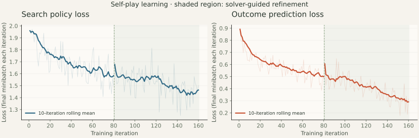

# Experiments and observations

The released agent has learned useful tactics and can play boards beyond its
training sizes. **Expert-human strength has not been demonstrated.** The stronger
endgame baseline exposes weaknesses, especially on an unseen rectangular board.
This report includes those failures alongside the improvements.

Measurements below were collected on October 9, 2026. Dimensions count boxes.
Both checkpoints and their training history are described in
[the model notes](../models/README.md).

## Training completed

Both phases use a six-block, 96-channel residual GIN with 272,648 parameters,
training seed 42, and uniformly sampled 1×2, 2×2, 2×3, and 3×3 boards. Four
single-threaded Ray workers collect self-play; the RLlib learner uses the shared
H200. Each iteration collects 16 games and performs 16 updates with batch size 128. AdamW starts at learning rate 0.0003; replay holds 20,000 positions.

| Measurement                        |      Bootstrap |            Bounded refinement |
| ---------------------------------- | -------------: | ----------------------------: |
| Iterations                         |           1–80 |                        81–160 |
| Additional self-play games         |          1,280 |                         1,280 |
| Additional positions               |         19,426 |                        19,384 |
| Cumulative games / positions       | 1,280 / 19,426 |                2,560 / 38,810 |
| Search simulations per decision    |             32 |                            64 |
| Exact endgame aid during self-play |       Disabled | Root with ≤12 remaining edges |
| Recorded loop time                 |       693.63 s |                      701.31 s |
| Median iteration time              |         8.55 s |                        8.62 s |
| Peak PyTorch allocation            |     148.47 MiB |                    148.50 MiB |
| Last 10 mean policy loss           |         1.5843 |                        1.4634 |
| Last 10 mean value loss            |         0.4996 |                        0.2910 |

Refinement resumes optimizer state and replay from bootstrap. It changes both
the search budget and solver availability, so their individual effects cannot
be separated from these runs. Bootstrap uses only learned search and game rules;
refinement is solver-guided self-play. Neither uses human games or move labels.

The two recorded loops total 23.25 minutes, excluding startup and evaluation.
Losses are the final minibatch reported in each iteration, not full-replay
averages. Lower loss alone is not evidence of stronger play.



The learner had a 4 GiB allocator cap and 0.15 application duty-cycle target.
Observed process-level GPU memory was approximately 918 MiB, including CUDA
context allocations. A separate process used approximately 34,500 MiB during
refinement and remained running afterward. No GPU modes, resets, or unrelated
processes were changed. These resource measurements do not establish zero
latency interference with the other workload.

The tested environment was Python 3.12.3, PyTorch 2.12.1 with CUDA 13.0, Ray/RLlib
2.58.0, Gymnasium 1.2.2, and NumPy 2.5.1. Resolved configurations and software
versions are in [training-summary.json](data/training-summary.json); complete
iteration metrics are in [bootstrap CSV](data/training-bootstrap.csv) and
[refinement CSV](data/training-refined.csv).

## Final test of the recommended checkpoint

`models/agent.pt` is bootstrap iteration 80. These fresh tests use evaluation
seed **2027**, 40 games per opponent/board, alternating seats equally, and 128
search simulations per decision. The agent's exact solver is **disabled**.
Boards 4×4 and 2×5 were absent from training. The 2×5 board was also absent from
the checkpoint-selection comparison.

“Tactical” takes available boxes and avoids giving away a third side when
possible. “Tactical + endgame” adds exact minimax for the final 12 edges; it is
stronger but is not an independently validated expert-human proxy. Random play
is included as a basic sanity check.

| Board | Opponent           | Wins–draws–losses | Win rate | 95% win interval | Score rate |
| ----- | ------------------ | ----------------: | -------: | ---------------: | ---------: |
| 3×3   | Random             |            40–0–0 |     100% |        91.2–100% |       100% |
| 3×3   | Tactical           |            38–0–2 |      95% |       83.5–98.6% |        95% |
| 3×3   | Tactical + endgame |           18–0–22 |      45% |       30.7–60.2% |        45% |
| 4×4   | Random             |            40–0–0 |     100% |        91.2–100% |       100% |
| 4×4   | Tactical           |            35–3–2 |    87.5% |       73.9–94.5% |     91.25% |
| 4×4   | Tactical + endgame |            33–1–6 |    82.5% |       68.0–91.3% |     83.75% |
| 2×5   | Random             |            40–0–0 |     100% |        91.2–100% |       100% |
| 2×5   | Tactical           |            33–4–3 |    82.5% |       68.0–91.3% |      87.5% |
| 2×5   | Tactical + endgame |           13–2–25 |    32.5% |       20.1–48.0% |        35% |

Score rate gives a draw half a point. Intervals use Wilson's formula with
z=1.96 for wins, not score rate. They describe uncertainty in these seeded
samples; correlations between games and opponent limitations are not modeled.
Raw outcomes, seats, margins, timings, and checkpoint hashes are retained in
[3×3](data/selected-search-3x3.json), [4×4](data/selected-search-4x4.json), and
[2×5](data/selected-search-2x5.json) receipts.

The 3×3 stronger-opponent result falls from 65% in the selection sample to 45%
in this fresh sample. That variation and the weak 2×5 result rule out a claim
of robust expert play or reliable arbitrary-size generalization.

## Checkpoint selection and refinement

The earlier seed-2026 sample informed checkpoint selection. Bootstrap was
evaluated in a single multi-board command; refinement used separate per-board
commands. RNG consumption differs, so these are descriptive comparisons rather
than paired trials. All entries below use 128 learned-search simulations with
the agent's solver disabled.

| Board / opponent         | Bootstrap W–D–L | Bootstrap score | Refined W–D–L | Refined score |
| ------------------------ | --------------: | --------------: | ------------: | ------------: |
| 2×2 / Tactical           |         20–18–2 |           72.5% |       25–12–3 |         77.5% |
| 2×2 / Exact              |         0–20–20 |             25% |       20–0–20 |           50% |
| 3×3 / Tactical           |          36–0–4 |             90% |        37–0–3 |         92.5% |
| 3×3 / Tactical + endgame |         26–0–14 |             65% |       23–0–17 |         57.5% |
| 4×4 / Tactical           |          32–2–6 |           82.5% |        35–2–3 |           90% |
| 4×4 / Tactical + endgame |          30–3–7 |          78.75% |        30–4–6 |           80% |

The unweighted mean score against tactical + endgame on 3×3 and 4×4 is 71.875%
for bootstrap and 68.75% for refinement. Bootstrap is the conservative default;
confidence intervals overlap and this small sample does not prove it is better.
Refinement improved exact small-board play and simple tactical results while
reducing training loss. It did not consistently improve the harder benchmark.

On 2×2, exact minimax gives the first player a forced 3–1 win. An optimal agent
therefore wins its 20 first-seat games and loses its 20 second-seat games against
perfect play. The refined checkpoint achieves that outcome in this sample with
its own solver disabled; this is a small-board check, not a human-strength result.

For completeness, refinement scores 90% against tactical and 63.75% against
tactical + endgame on 2×5 in its seed-2026 sample. That result uses a different
checkpoint and seed from the final default-agent test above.

Receipts: [bootstrap](data/bootstrap-search.json), refinement
[2×2](data/refined-search-2x2.json), [3×3](data/refined-search-3x3.json),
[4×4](data/refined-search-4x4.json), and [2×5](data/refined-search-2x5.json).

## Did the network learn, and does search help?

Greedy policy-only tests remove search and the agent's endgame solver. The
untrained control is the same architecture initialized with seed 42. Tests use
seed 2026 and 40 balanced-seat games per entry; ties are randomized.

| Board / opponent         | Untrained greedy score | Bootstrap greedy score | Bootstrap search score | Refined greedy score |
| ------------------------ | ---------------------: | ---------------------: | ---------------------: | -------------------: |
| 3×3 / Tactical           |                     0% |                    75% |                    90% |                87.5% |
| 3×3 / Tactical + endgame |                     0% |                  42.5% |                    65% |                32.5% |
| 4×4 / Tactical           |                     0% |                    80% |                  82.5% |                82.5% |
| 4×4 / Tactical + endgame |                     0% |                 71.25% |                 78.75% |                  60% |

The trained greedy policy improves substantially over the untrained control.
Search further improves several measured scores, particularly on 3×3. No
untrained-search control was run, and these samples do not isolate every source
of improvement. A GCN/GAT/GIN architecture comparison has not been performed.

Receipts: [untrained policy](data/untrained-policy.json),
[bootstrap policy](data/trained-policy.json),
[refined policy](data/refined-policy.json).

## What the UI's solver contributes

The UI enables exact minimax at the root once at most 12 legal edges remain.
Seed-2026 bootstrap tests with that aid score 50% against exact 2×2 play,
67.5% against tactical + endgame on 3×3, and 81.25% on 4×4. The corresponding
pure-search scores are 25%, 65%, and 78.75%. The UI displays when an exact
endgame decision is used; those moves are not credited to the learned network.

Full results are in [bootstrap-aided.json](data/bootstrap-aided.json). The README
GIF records a real agent-versus-agent game with the default checkpoint and the
UI's normal solver setting. It is a demonstration, not a benchmark.

## Reproduce and extend

Run each board separately to reproduce the final-test RNG schedule:

```bash
adb evaluate --checkpoint models/agent.pt --sizes 3x3 --games 40 \
  --simulations 128 --seed 2027 --output runs/selected-search-3x3.json
adb evaluate --checkpoint models/agent.pt --sizes 4x4 --games 40 \
  --simulations 128 --seed 2027 --output runs/selected-search-4x4.json
adb evaluate --checkpoint models/agent.pt --sizes 2x5 --games 40 \
  --simulations 128 --seed 2027 --output runs/selected-search-2x5.json
python scripts/ablate.py --checkpoint models/agent.pt --output runs/ablation
```

Prediction caching was added after the original bootstrap evaluation; old and
new receipt timings are not a controlled speed comparison. No speedup over a
pure implementation is claimed. Seeds, library versions, tie handling, and
hardware can affect reproducibility; worker resume also restarts RNG streams.

To redraw the loss chart, install the analysis extra and run:

```bash
python -m pip install -e '.[analysis]'
python scripts/plot_training.py --input docs/data/training-bootstrap.csv \
  docs/data/training-refined.csv
```

Before claiming expert strength, run multiple independent training seeds,
larger-board training, held-out sizes and rectangles, independent chain-aware
opponents, and balanced matches with experienced human players. Long-range
chain decisions and rectangular transfer are the clearest current weaknesses.
