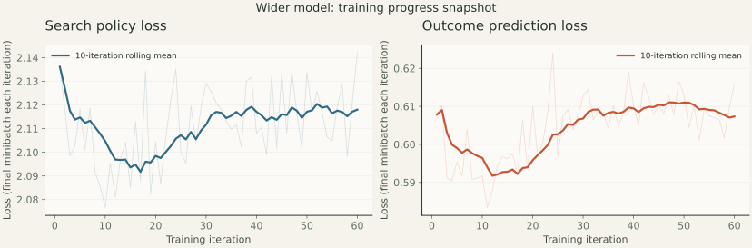
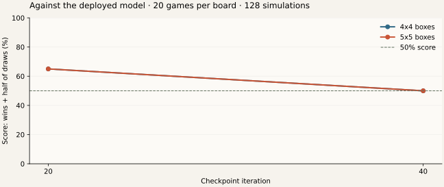

# Wider model: progress snapshot

Captured **October 10, 2026, 19:30 UTC**, while training was running. This is a
dated snapshot, not a live dashboard. The [experiment report](wide-run.md) will
record the completed run and fresh tests.

The 2.42-million-parameter model completed **60 rounds, 7,680 games and 340,828
positions**. Recorded training time was 3.91 hours, with approximately 4.07 hours
remaining in the supervisor's eight-hour budget. There were no recovery restarts.
The learner peaked at 57.94 GiB allocated memory. Port 9003 still served the
validated 96-channel model.

## What the losses mean

| Metric | First 10 rounds, mean | Latest 10 rounds, mean | Meaning |
| ------ | --------------------- | ---------------------- | ------- |
| Policy loss | 2.1047 | 2.1180 | How closely predicted moves match the search probabilities |
| Value loss | 0.5964 | 0.6073 | Squared error when predicting the final win, draw or loss |
| Total loss | 2.7011 | 2.7253 | Policy loss plus value loss |

Losses are roughly flat, with a small increase in this comparison. They are
the final learner minibatch each round, not an average over the entire replay
buffer or all 16 updates. Lower is better for fitting those particular targets,
but the positions and targets change as self-play changes. Training loss alone
does not demonstrate stronger play.



## Reward and playing strength

Each finished game supplies **+1 for a win, 0 for a draw and −1 for a loss**,
from the player at each recorded position. Intermediate reward is zero. The
value head learns this result; search supplies the policy target. Rewards for
the two players sum to zero, so average reward across both self-play opponents
is not a useful measure of improvement. There is no conventional PPO-style
episode-reward curve for this custom RLlib AlphaZero loop.

Checkpoint comparisons against a fixed opponent are more useful:

| Candidate | 4×4 score vs deployed model | 5×5 score vs deployed model | Mean across all six selection tests |
| --------- | -------------------------- | -------------------------- | ----------------------------------- |
| Iteration 20 | 65% | 65% | 79.17% |
| Iteration 40 | 50% | 50% | 76.67% |
| Deployed baseline | — | — | 78.75% |

Iteration 20 won 13 and lost seven games on each board. It currently leads
selection, but its average across all six tests only narrowly exceeds the
baseline and its scripted 5×5 endgame result was worse. Iteration 40 did not
improve on it. The six-test mean includes both boards against tactical endgame,
chain control and the fixed checkpoint. The baseline's corresponding mean
includes its own seeded self-duel results.



These comparisons use seed 3050, 20 games per opponent and board, balanced seats,
six randomized opening moves in checkpoint duels, 128 simulations and no exact
endgame aid for the agent. Samples are small; these are selection games, not
fresh deployment tests. The iteration-60 comparison was not complete at capture.
Deployment still depends on fresh Standard and Deep comparisons using seed 3051.

## Inspect the running experiment

On the training machine, completed rounds append their metrics here:

```bash
tail -f runs/wide-20261010/metrics.jsonl
cat runs/wide-20261010/supervision.json
cat runs/wide-selection-20261010/leaderboard.json
```

Sampling currently takes roughly 209 seconds per round, followed by about 19
seconds of learner updates. Metrics update at completed round boundaries, so
several minutes between records is expected. The logs also include replay
size, elapsed time, allocation peaks and gradient norms.

The [CSV](data/wide-progress/training-wide-20261010.csv),
[snapshot](data/wide-progress/snapshot.json),
[leaderboard](data/wide-progress/leaderboard.json) and complete duel receipts in
[the data directory](data/wide-progress/) preserve this report's numbers.
To generate updated losses from the live logs:

```bash
python scripts/report.py --run runs/wide-20261010 --output runs/wide-progress
python scripts/plot_training.py \
  --input runs/wide-progress/training-wide-20261010.csv \
  --output runs/wide-progress/losses.svg
```
