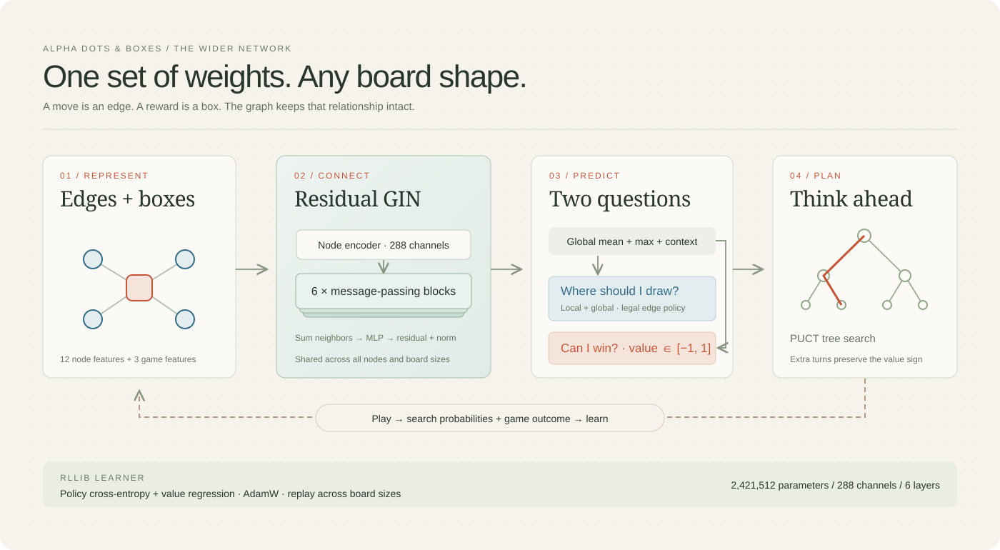

# Wider graph network

This experiment expands the validated six-layer residual GIN from 96 to 288
channels. Parameter count increases from **272,648** to **2,421,512** (8.88×).
The graph representation, legal-action masks, board-size support and policy/value
heads retain their roles. Extra capacity has not yet demonstrated stronger play.

The source is seed-44 iteration 10, the model deployed after the eight-hour
campaign. Channel replication and zero-sum outgoing perturbations transfer its
policy and value instead of initializing play randomly. The copies receive
different gradients and can develop different features during training.

| Check | Observation |
| ----- | ----------- |
| Transfer parity | 206 positions on six board shapes, with seven padding nodes; maximum logit difference 4.77×10⁻⁶ and value difference 1.03×10⁻⁶ |
| NumPy export parity | The same 206-position protocol; maximum logit difference 2.87×10⁻⁶ and value difference 6.86×10⁻⁷ |
| RLlib GPU updates | Three disposable 5×5 batches: 10,000, 12,288, 12,288 positions; peak allocation 57.94 GiB under a 72 GiB learner cap |
| Search probes | Eight positions with CPU batches of eight took 14.09 seconds median; 32 positions with captured CUDA batches of 32 took 3.71 seconds median |
| Software checks | 71 tests passed, including transfer parity, independent gradients, NumPy export and actual RLlib updates |

Search probes use 512 simulations, three repeats, seed 20261010 and one CPU
thread per process. Their position counts and search depths differ, so they are
not a controlled CPU/GPU speed ratio. Concurrent host work also affects timings.
The learner probe verifies allocation and updates using synthetic targets; it
does not measure strength or modify the starting checkpoint.

Seed 45 uses an eight-hour training budget, 512 simulations, weighted 5×5
sampling, four GPU samplers with 32 games each, 16 updates per iteration,
12,288-position batches and 500,000 replay positions. Each GPU sampler has a
1 GiB allocator cap; CUDA contexts are additional. Learner allocation is capped
at 72 GiB. Full checkpoints and bounded OOM recovery retain completed rounds.
The original eight-hour campaign remains separate; these are new phase counters.

Checkpoint selection uses seed 3050 on 4×4 and 5×5 against two scripted
opponents and an immutable copy of the deployed model. Fresh tests use seed
3051, balanced seats and six randomized opening moves. The recorded deployment
gate requires at least 50% score against that model on both boards at Standard
(128 simulations, no exact aid) and Deep (512 simulations, 12-edge exact aid),
and strictly more than 50% on 5×5 Deep. This is a practical regression check,
not statistical proof or an expert-human strength claim.

**Status: training in progress.** Port 9003 retains the validated 96-channel
model pending fresh comparisons. [Initial receipts](data/wide-initialization/)
preserve hashes, dimensions, timings and numerical errors.

